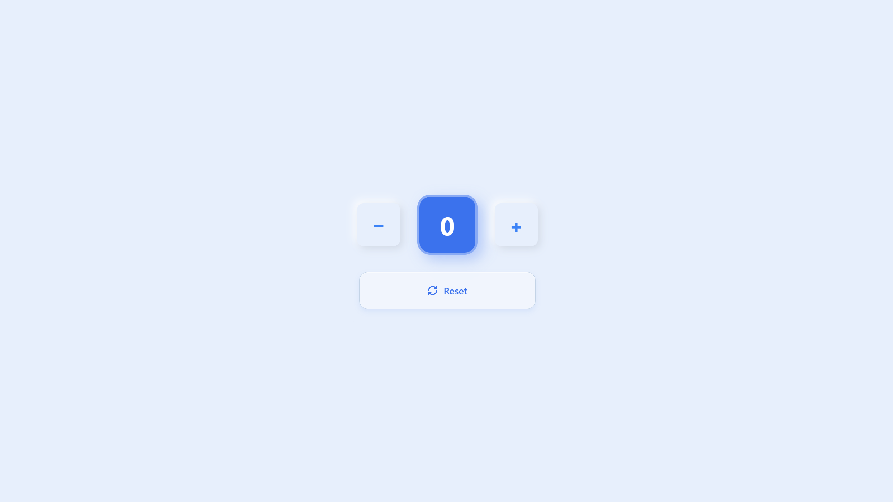

# 🔢 Counter App

**Created:** August 2, 2026  
**Last Updated:** August 7, 2026

🔗 **Live Demo:** [Click Here 👆](https://counter-app-pi-roan.vercel.app/)

A clean, minimal counter application built with **HTML**, **Tailwind CSS**, and **vanilla JavaScript**. The UI features a soft, modern aesthetic with rounded cards, subtle shadows, and a soothing blue color palette.

---



---

## Features

- ➖ **Decrement** button to reduce the count
- 🔢 **Live counter display** in a highlighted blue card
- ➕ **Increment** button to increase the count
- 🔄 **Reset** button to bring the counter back to `0`
- 🎨 Soft UI (soft-shadow / neumorphic-inspired) design
- 📱 Fully responsive layout

---

## Tech Stack

| Technology           | Purpose                         |
| -------------------- | ------------------------------- |
| HTML5                | Page structure                  |
| Tailwind CSS         | Styling and layout              |
| JavaScript (Vanilla) | Counter logic and interactivity |

---

## Project Structure

````
## 📂 Project Structure

```text
counter-app/
├── 📁 assets/               # Static assets
│   └── 📁 images/           # Images and icons used in the project
│       └── 📄 preview.png   # Project preview image
├── 📁 node_modules/         # Project dependencies managed by npm
├── 📁 src/                  # Source folder for application logic
│   └── 📄 main.js           # Main JavaScript entry point
├── 📄 index.html            # Main HTML file and entry point for Vite
├── 📄 package-lock.json     # Locked versions of npm dependencies
├── 📄 package.json          # Project metadata, scripts, and dependencies
├── 📄 README.md             # Project documentation
└── 📄 vite.config.js        # Vite build and development configuration
````

---

## How It Works

1. The counter value starts at `0` and is displayed in the center card.
2. Clicking the **`+`** button increases the value by 1.
3. Clicking the **`−`** button decreases the value by 1.
4. Clicking **Reset** sets the value back to `0`.

---

## Customization

- Change the primary color by swapping `blue-500` / `blue-50` with any Tailwind color (e.g. `emerald-500`, `rose-500`).
- Adjust the step size in `script.js` to increment/decrement by values other than 1.
- Add min/max limits to prevent the counter from going below or above a set range.

---

<div align="center">

### ✨ Built one click at a time

_"Every great app starts with someone brave enough to click `+` first."_

Made with 💙 and a little too much Tailwind

⭐ **If this counter counted anything for you, give the repo a star!** ⭐

</div>
